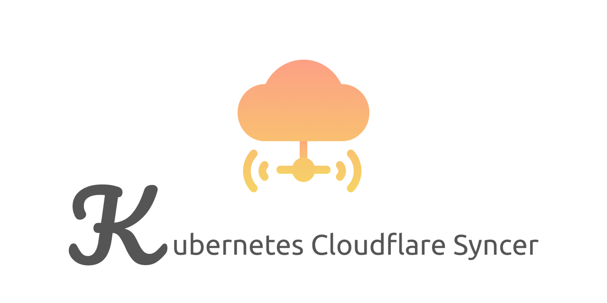

This repository is inspired by [calebdoxsey/kubernetes-cloudflare-sync](https://github.com/calebdoxsey/kubernetes-cloudflare-sync) and for syncing Cloudflare DNS and any IP addresses list on Kubernetes cluster.

Currently we support syncing IPs on GKE and GCE.

For GKE, please read [./pkg/gke](./pkg/gke).

For GCE, please read [./pkg/gcloud](./pkg/gcloud).

You can implement any other way to get IPs on cluster by implementing the `interface` below.

```go
// IPLister should implement Setup and List function
// to efficientlly plugin the mechanism of listing
// IP address.
type IPLister interface {
	Setup()
	List() []string
}
```

This project is useful for the non-managed clusters on some Cloud Providers that does not support pure public network interface. 
